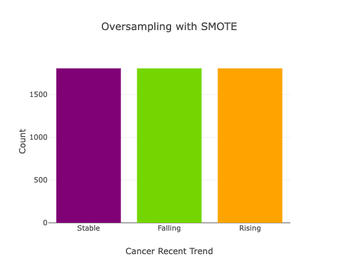

# Predicting cancer incidence associated with environmental pollutants

 ## Project Overview

To create a thriving and resilient community it is fundamental that people live in a clean environment. Our combined experience in both community health and sustainability led us to develop a machine learning algorithm to predict cancer associated with environmental pollutants. 

A 2016 study out of Hong Kong, [Cancer Mortality Risks From Long-term Exposure to Ambient Fine Particle](https://aacrjournals.org/cebp/article/25/5/839/71066/Cancer-Mortality-Risks-from-Long-term-Exposure-to"), showed that long-term exposure to  particle pollution rates is associated with a higher risk of cancer in various organs. In fact, the study showed that every 10 µg/m3 of increased particulate matter exposure [heightened the risk of dying from cancer by 22%](https://www.aacr.org/patients-caregivers/progress-against-cancer/air-pollution-associated-cancer/).

According to the [CDC](https://www.cdc.gov/nceh/tracking/topics/AirQuality.htm) (Centers for Disease Control and Prevention), air pollution increases health concerns that affect millions of people. Particle pollution, exposure to toxic chemicals, and ozone concentrations can have a significant impact on human health. While the cancer risk of air pollutants is considered a clear link, the link between [ozone exposure and cancer](https://www.nature.com/articles/s41370-019-0135-4) incidence isn't as straightforward. As reported by the [EPA](https://www.epa.gov/indoor-air-quality-iaq/ozone-generators-are-sold-air-cleaners) high ozone concentrations may harm the lungs and worsen chronic respiratory diseases. 

The CDC and the EPA (Environmental Protection Agency) continuously gather air quality data. We decided to work with two different datasets from the CDC for this project,  [Daily PM2.5 Concentrations All County, 2001-2016](https://data.cdc.gov/Environmental-Health-Toxicology/Daily-PM2-5-Concentrations-All-County-2001-2016/7vdq-ztk9), and [Daily County-Level Ozone Concentrations, 2001-2016](https://data.cdc.gov/Environmental-Health-Toxicology/Daily-County-Level-Ozone-Concentrations-2001-2016/kmf5-t9yc). 
The first dataset shows a 24-hour average of particle pollution or particulate matter PM2.5 concentrations in micrograms per cubic meter of air or *µg/m3*. The second dataset shows an 8-hour ozone concentration in parts per billion (ppb) within 3 meters of the surface of the earth.  Both datasets contain data from 2001 to 2016 and are organized to show the maximum prediction, the median prediction, and the mean prediction for all counties across the US. 
As per the EPA, the current air quality level for PM2.5 is a 24-hour standard of 35 ug/m3, and for ozone the standard is currently at 0.075 parts per million (ppm) averaged over 8 hours.
We also used a Kaggle dataset [Cancer Mortality & Incidence Rates: (Country LVL)](https://www.kaggle.com/datasets/thedevastator/us-county-level-cancer-mortality-and-incidence-r?resource=download) that showed US county-level cancer incidence rates from 2000 to 2014.  From this dataset, we only kept US counties and their recent cancer trend. This dataset contained data from the National Cancer Institute and the CDC; however, it had some limitations, such as not having data available due to state legislation or patient confidentiality and containing only rates for invasive cancer. We scaled all this data down to represent select counties in the United States.

### Objective

The main goal was to develop a machine learning algorithm to predict cancer associated with environmental pollutants. The following questions helped us with our intial analysis. 

- Do the levels of air particulate matter affect the number of cancer instances in the United States?

- Is the rate of cancer incidence in counties with more pollution higher than in those with moderate and lower PM rates?

- Are specific years more impactful than others?

- Is there a significant correlation between cancer incidence and ozone exposure?

<strong> Team members and their roles:</strong> 
<a href="https://github.com/cbeckler">Charlie Beckler</a> - Team lead, Engineer
 
   <a href="https://github.com/meggrooms">Meg Grooms</a> - Database Management, communications
 
 <a href="https://github.com/katiarp">Katia Paredes</a> - ETL, Machine Learning Model, Dashboard Development
 
 <a href="https://github.com/cmwardcode"> Cassidy Ward</a> - Website and Machine Learning Prototypes
 
 

<a name="TOC">
<h2>Table of Contents</h2>
  
<a href="#ETL">
1. ETL and EDA  
<a href="#SQL">
2. SQL Database 
<a href="#MLM">
3. Machine Learning Model 
<a href="#viz">
4. Visualizations and Results 
<a href="#dash">
5. Dashboard 
<a href="#chall">
6. Challenges and Strengths 
<a href="#ahead">
7. Looking ahead 
<a href="#tech">  
8. Technologies 
</a>

 
<h3>Exploration Data Analysis (EDA) and Extract Transform and Load (ETL)</h3>

For our EDA and ETL, we performed the following:

- Imported original datasets in CSV format for cancer (from Kaggle), and PM2.5 and ozone (from CDC) into Pandas DataFrames in Colab notebooks
- Dropped all columns from the cancer DataFrame except for recent trend and county FIPS 
- Removed from the cancer DataFrame all FIPS (i.e. county identifier) where “recent trend” (either rising, falling, or stable) was not available 
- The cancer data set comprised a single “recent trend” data point per FIPS based on data from 2000 to 2014; however, the cancer dataset was not broken down by year. Pollution and ozone datasets were broken down by year from 2001 to 2016, so we decided to remove years 2015 and 2016 from these DataFrames to have the timeframes as close as possible for all 3 DataFrames
- Outliers were removed from the pollution PM2.5  dataset and none were found in the ozone dataset
- Aggregated data using the mean pollution and ozone values by FIPS and year 
- The aggregation resulted in a long format table and was converted into a wide format table to reduce data dimensionality
- Created a merged DataFrame with cancer, pollution and ozone data joined by FIPS
- Created an additional DataFrame that included null values
- Used a cloud service, ElephantSQL, to save the merged DataFrame into a PostgreSQL database using PySpark 

 

<h3> SQL Database  </h3>

ElephantSQL and the PostgreSQL database were used to have access to our analysis data without having to run all the Colab code to generate the DataFrames again. We created different tables for different purposes. For instance:

Model_dataset: used to train the machine learning model
Prediction_model_dataset: used to test the model

 
 
<h3> Machine Learning Model </h3>
The goal of the Machine Learning Model was to ingest the inputs of all counties IDs/FIPS along with the maximum, minimum, and mean values for both air pollutants (PM2.5) and Ozone (ppb) and the cancer incidence trends associated for years 2000-2014. The model was trained to predict cancer incidence trends with a our model dataset. We also created a new data set to predict and output future trends of cancer incidence for each county. The selection of a machine learning model was based on several factors. We selected a supervised machine learning model because the input data was labeled. We elminated binary classification models because the dataset containd three different labels so the best fit for our data was a trinary classification. Support Vector Machine (SVM) was also considered because of its ability to analyze the data and label the proper class but was outperformed by Balanced Random Forest.

 

The “recent trend” column in the dataset has a “stable”, “falling” or “rising” cancer incidence rate for each county. This column became our target variable. Test and train data were split using test_train_split, stratified on the Y axis.  The training data was then resampled with SMOTE to correct for the imbalanced classes. The SMOTE algorithm increased the data by creating synthetic data points based on the original data. 

 

 
<h4> SMOTE Algorithm </h4>
The advantage of SMOTE is that we are creating slightly different data points rather than producing copies, thus providing variety, balance, and quality in data. After resampling our dataset, we chose a Balanced Random Forest Classifier. This learning model was a good choice for our data due to the imbalanced classes.  A Balanced Random Forest Classifier is not biased toward a majority class, giving importance to all classes, and delivering a balanced accuracy. Our machine learning model was created using 100 n_estimators.
Intially, this model performed extremely well. However, due to an error in between the ETL and model development stages caused a duplication of the dataset. The error resulted in a model that initially gave an accuracy of more than 90%. This error was not caught and fixed until late in the project development process so after fixing our data duplication this model gave an accuracy of 37%

 

 
<h4> Cluster Centroid Algorithm </h4>
After the previous setback, a new machine learning model was created after the completion of the project. A Cluster Centroid Algorithm was applied to undersample the data. One advantage of Cluster Centroid is that we use actual data instead of creating new data. The data is undersampled by clustering datapoints using the euclidian distance, that is the shortest distance between two points. The undersampled datapoints are classified into better-defined clusters, which makes the data less vulnerable to outliers. However, not having sufficient data could be problematic when usign Cluster Centroid Algorithm. 

 

After applying the Balanced Random Forest Classifier we got a 51% accuracy.

Looking at the classification imbalanced report we can see that the geometric  mean is 0.66, it improved from that of SMOTE algorithm that was 0.43. Having a low geometric mean indicates that we could be overfitting the majority class and underfitting the minority class.  The Geometric mean looks for balance between sensitivity and specificity, therefore it's a good metric for imbalanced classes.

 

<a href="#TOC">Table of Contents
 

  

 ## Machine Learning Visualizations and Results
 
 The following bar charts show the cancer recent trend count before and after resampling with the SMOTE algorithm. We can see that the  *falling* and *rising* classes have only a few datapoints before resampling. After applying SMOTE algorithm all classes now have 1807 datapoints each. 
  

After resampling we applied a balanced random forest classifier. This model is the best fit for imalanced data because it's not biased towards the majority class. In this case this model was not going to be ovelooking the *falling* and *rising* classes

The following image shows one of the random forest created with our machine learning model. The model used 100 n_estimators that means that 100 trees were created. Having enough decision trees makes a model stronger and more stable.

This graph shows the decison tree making process which is essentially a series of questions designed to assign a classification. In this case, an example of a question that can be asked is the following: **Is maximum ozone prediction less than or equal to 75 ppb?** If the answer is yes, then it will classify it as *stable*, if the answer is no then it keeps asking questions so it can assing classes.  

 

As we can see in the image bellow, the confusion matrix generated using the SMOTE algorithm still favors the majority class, classifying around 90% of the *stable* class accurately, and only 20% of the *falling* class, and none of the rising.

After applying the cluster centroid algorithm the datapoints were undersampled to 37 datapoints for each class. This improved the overall balanced accuracy from 37% to 51%. We can observe in the image below that the minority classes are not being ignored and all classes have 50% accuracy each. 

By looking at the feature importances we can see that within the model it was clear that ozone was more impactful than PM 2.5
The year 2006 also appeared to be the most impactful year, followed by 2009. 

 
 <a href="#TOC">Table of Contents 
 
 
 
   
 
## Interactive Dashboard and Map

 

A new [Dashboard](https://katiarp.github.io/Cancer_Incidence_Dashboard/) was developed to better visualize the data. This web application allows you to observe scatterplots that show the preliminary analysis of the pollution and ozone data, a sample of our model dataset, interactive charts, and the interactive map showing our results and predictions. 

The code for this dashboard can be found in this [repository](https://github.com/katiarp/Cancer_Incidence_Dashboard)

This interactive map was created to display the actual trend from our dataset and the results of our model. The model was then applied to a different 15-year time slice from 2003 to 2016 predicting cancer incidence rates for counties where this data was non-existent. The map displays actual trend, model prediction, and future trend layers and allows you to turn them on or off.

[Interactive Map: Cancer Incidence Rates by County](https://katiarp.github.io/visualization_map)

  
The code for the interactive map can be found in this [repository](https://github.com/katiarp/visualization_map)
<a href="#TOC">Table of Contents

  

   

<h2>Challenges and Strenghts</h2> 

The team took real risks using untested data. Separate datasets with several million rows each were aggregated and combined to form one cohesive model dataset. The current model’s accuracy can be improved as more data is released by the CDC and other agencies. For instance, we know that studies have shown a correlation between pollution and cancer; however, it's possible that we need to gather more data to improve the model's performance. 

The team put together an interesting project with strong engineering behind it. The creation of a web application to visualize the predictions of future machine learning models is a great tool to explore the data and the results of our analysis. We also gained invaluable expertise in how to handle projects with real data instead of a curated dataset.

  
  

<a href="#TOC">Table of Contents
  

   
<h2>Looking ahead</h2>  

As a preliminary tool, this web application and model to predict cancer incidence looks promising. Once accuracy is improved, stakeholders could use the map visualization to see which counties could be at risk and take action. For example, counties could investigate the environmental causes contributing to raising cancer incidences and allocate resources for mitigation. Future versions of this model and web application could include the prediction of other illnesses associated with environmental pollutants. 
 

 <a href="#TOC">Table of Contents

<a name="tech"> 
  
<h3>Technologies</h3>
• Python / Pandas 
• PySpark  
• Leaflet 
• SQL
• PostgreSQL / ElephantSQL 
• HTML / CSS 
• JavaScript 
• Bootstrap 
• Plotly 

  

<a name="sources">
 
 ## Sources

[Daily PM2.5 Concentrations All County, 2001-2016](https://data.cdc.gov/Environmental-Health-Toxicology/Daily-PM2-5-Concentrations-All-County-2001-2016/7vdq-ztk9)

[Daily County-Level Ozone Concentrations, 2001-2016](https://data.cdc.gov/Environmental-Health-Toxicology/Daily-County-Level-Ozone-Concentrations-2001-2016/kmf5-t9yc)

[Cancer Mortality & Incidence Rates: (Country LVL)](https://www.kaggle.com/datasets/thedevastator/us-county-level-cancer-mortality-and-incidence-r?resource=download)
 
      
<a href="#backup"> Top of page</a> 
